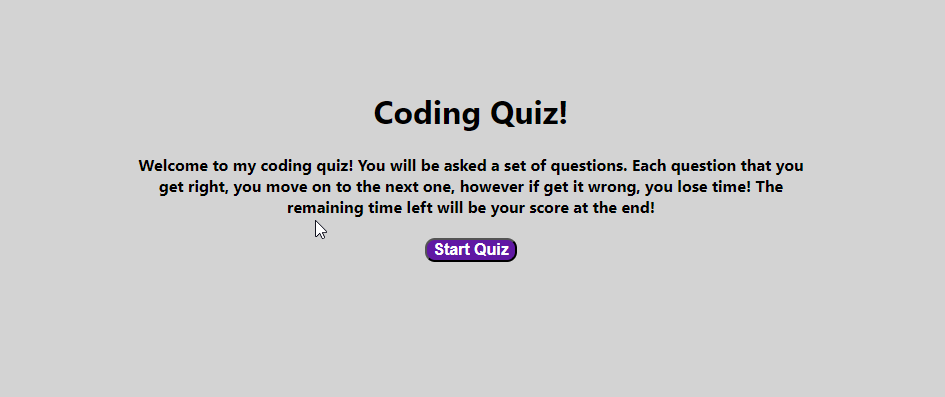
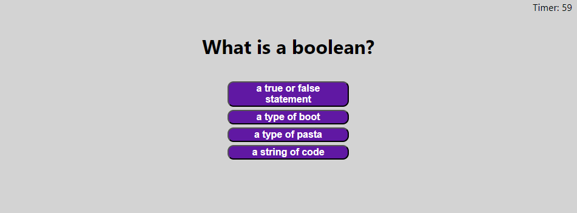
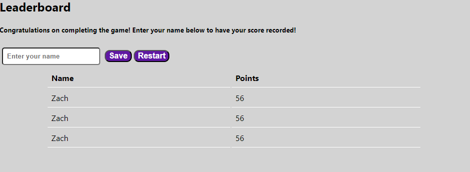

# Fullstack Development Challenge 4

## Welcome to the fourth challenge for the UCLA edX full stack development bootcamp! 

In this challenge we were supposed to come up with a coding quiz. Lets start with our user story and acceptance criteria:

## User Story

```
AS A coding boot camp student
I WANT to take a timed quiz on JavaScript fundamentals that stores high scores
SO THAT I can gauge my progress compared to my peers
```

## Acceptance Criteria

```
GIVEN I am taking a code quiz
WHEN I click the start button
THEN a timer starts and I am presented with a question
WHEN I answer a question
THEN I am presented with another question
WHEN I answer a question incorrectly
THEN time is subtracted from the clock
WHEN all questions are answered or the timer reaches 0
THEN the game is over
WHEN the game is over
THEN I can save my initials and my score
```

## The Completed Challenge
As you can see below, we now have a completed coding quiz in which you can play and attempt to get the high score on! You can see this below:








To visit this site and try to get your own high score, you may click [here](https://falafelrapper.github.io/code-quiz/)!

## Credits
This refactor was completed by Zachary Roy with help from Bryan Swarthout via Office Hours.